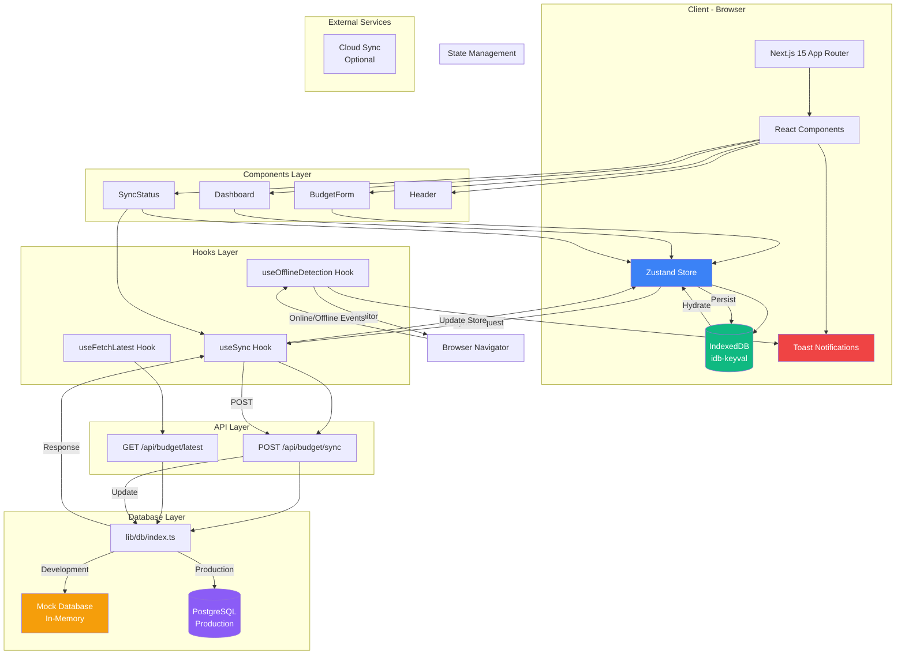
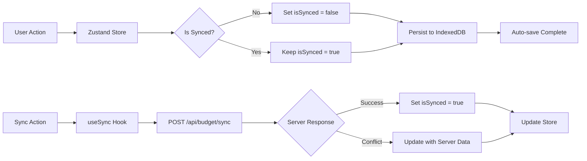
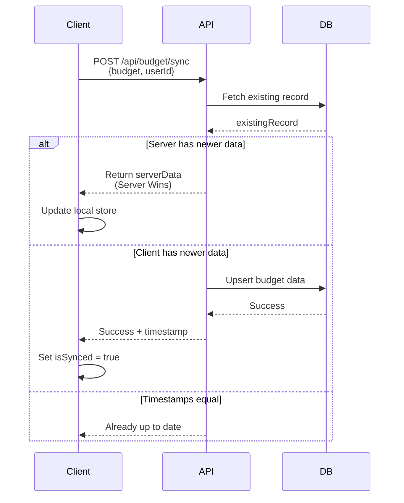
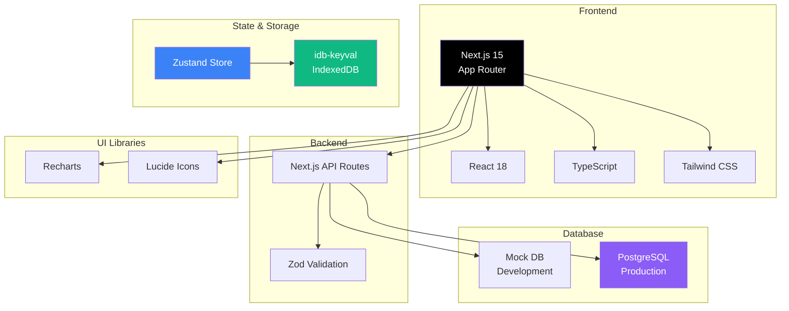

# BudgetBox Architecture

## System Architecture Diagram



## Data Flow

### 1. User Input Flow
```
User Input → BudgetForm → Zustand Store → IndexedDB
                                    ↓
                            Auto-save (onBlur/Enter)
```

### 2. Sync Flow (Online)
```
Local Store → useSync Hook → POST /api/budget/sync
                                    ↓
                            Conflict Resolution
                                    ↓
                            PostgreSQL/Mock DB
                                    ↓
                            Response → Update Store
```

### 3. Offline Detection Flow
```
Browser Navigator → useOfflineDetection → Toast Notification
                                              ↓
                                    Persistent Warning
```

## Component Hierarchy

```
app/
├── layout.tsx (Root Layout)
│   ├── ToastProvider (Global Toast Context)
│   └── Header (Navigation)
│
└── page.tsx (Home Page)
    ├── useOfflineDetection (Global Hook)
    ├── SyncStatus
    │   └── useSync Hook
    ├── BudgetForm
    │   └── useBudgetStore (Zustand)
    └── Dashboard
        └── useBudgetStore (Zustand)
```

## State Management Architecture



## Sync Strategy Flow



## Technology Stack Diagram



## Key Architectural Decisions

1. **Offline-First**: All data is stored locally first, then synced when online
2. **Last Write Wins**: Conflict resolution based on timestamps
3. **Local Storage**: IndexedDB for better performance and capacity than localStorage
4. **Type Safety**: Strict TypeScript with Zod validation
5. **Component-Based**: Modular React components for maintainability
6. **Hook Pattern**: Custom hooks for reusable logic (sync, offline detection)

